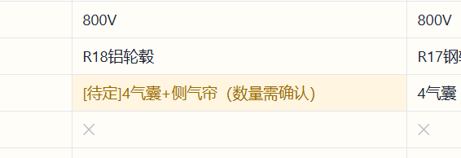
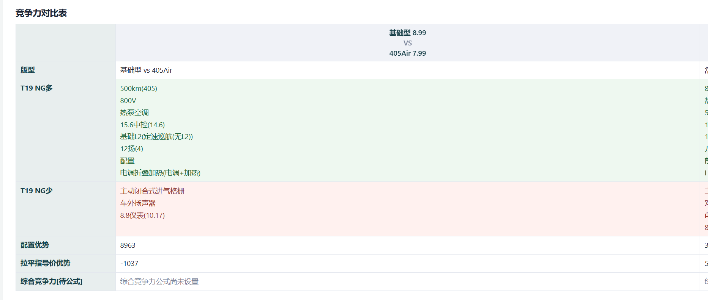

# 产品小工具

产品小工具面向汽车产品和竞品分析工作，覆盖两条流程：从汽车之家读取车型配置并整理成配置阶梯，以及导入本品配置后与历史竞品逐项比较并计算配置优势。

## 下载 Windows 程序

同事无需安装 Python 或了解代码，直接点击下面的链接下载并运行。当前发布包是
**真正的单文件程序**，只需下载 `carkit.exe`，不需要另带 `_internal` 文件夹：

**[下载产品小工具 Windows 程序（最新版本）](https://github.com/a18012239736-rgb/carkit/releases/latest/download/carkit.exe)**

如果直接点击没有开始下载，也可以打开 [`release`](https://github.com/a18012239736-rgb/carkit/tree/master/release) 文件夹，点击 `carkit.exe` 后选择下载。下载后双击 `carkit.exe` 即可启动。

## Windows 使用

直接运行打包后的 `carkit.exe`。程序会在桌面创建 `Codex` 文件夹保存数据和结果。抓取时需要 Edge 或 Chrome；遇到汽车之家验证，在浏览器完成验证后回到程序点击“验证后继续读取”。

## 第一次使用

1. 在本页顶部下载 `carkit.exe`。
2. Windows 如果显示安全提示，选择“仍要运行”。
3. 双击程序，等待窗口打开。
4. 所有抓取数据、配置快照和导出结果都会保存在桌面的 `Codex` 文件夹中。
5. 程序关闭后再次打开，历史记录会自动保留。

## 配置阶梯

在“配置阶梯”页面输入车型名称、车系编号或汽车之家配置页网址，选择年款并抓取完整配置。选择输出版型，为每个后续版型指定比较基准，检查配置后导出 Markdown。

程序保留汽车之家原始数据，阶梯文档只记录相对基准增加或减少的项目。历史车型可以继续编辑、重新导出或删除；删除的数据会移入工作目录的回收站。

### 抓取车型

在“配置阶梯”页面输入车型名称、汽车之家车系编号或配置页网址，年款可以留空以使用最新年款。搜索结果出来后选择正确车系，再选择要读取的版型。程序会保存汽车之家完整配置表，包含未用于阶梯输出的原始行。

### 指定版型关系

第一行作为基础配置。后续版型需要从下拉框选择比较基准，例如“舒适型”相对“基础型”，“高配型”相对“舒适型”。程序只输出相对基准新增或减少的配置，不会把基础配置重复写在每一级。

### 修改和导出

点击“检查配置”后可直接修改配置单元格。常用项目提供下拉选项，也可以选择“自定义填写”。未提及的项目填 `✕`，明确没有配置也填 `✕`，尚未确认填 `[待定]`。确认版型、价格和配置后，点击“导出配置阶梯 Markdown”。

配置校对表会把待定项目用醒目颜色标出，并提供下拉选项：



## 竞争力对比

1. 导入配置阶梯 PPT，或载入已有本品快照。
2. 在完整清单中校对本品配置。未提及的项目按无配置处理，明确待定的项目不参与比较。
3. 选择历史竞品并检查竞品配置。
4. 在当前页面直接修正本品和竞品配置。修正保存到工作副本，不覆盖原始抓取数据。
5. 手动指定版型配对并运行对比。

结果包含 P21 风格竞争力表、41 项判定明细和逐项赋值计算明细，并可导出 Markdown。程序不会按价格自动配对版型。

### 导入本品配置

本品通常使用配置策略 PPT 的配置阶梯页。进入“本品配置”或竞争力对比中的“导入本品 PPT”，选择对应页面并解析。程序先识别版型、价格和继承关系，再展开为完整清单。

导入后必须检查完整配置表：

- 下拉框可以填写气囊、激光雷达、轮径与轮圈材质、驾驶辅助、天窗、座椅等项目；
- 需要输入特殊内容时选择“自定义填写”；
- 未提及的清单项目按 `✕` 处理；
- PPT 明确写“待定”的项目保留 `[待定]`，不会参与多/少和金额计算；
- 修改指导价时使用万元，例如 `8.99`。

点击“确认并保存本品配置”后，快照才会出现在竞争力对比的本品列表中。

### 检查竞品配置

选择历史竞品后点击“修改当前竞品配置”。竞品表使用汽车之家抓取和阶梯归一化结果，发现识别错误时可以直接修改。保存的是竞品阶梯副本，原始抓取数据不会被覆盖。

### 指定版型和查看结果

在“版型配对”区域逐组选择本品版型和竞品版型。版型必须人工配对，程序不会按价格或名称自动猜测。运行后可以查看：

- 配置优势：本品多项金额合计减去本品少项金额合计；
- 拉平指导价优势：配置优势加上竞品指导价减本品指导价的差额；
- 每项配置的计价规则和金额；
- 41 项配置的多、少、同、不计判定。

发现配置或价格错误时，先修改本品或竞品配置，再重新运行对比。

竞争力结果示例：



## 配置与赋值规则

程序使用完整配置清单进行比较。汽车之家没有该配置行，按无配置处理；选装配置不作为标配；清单中标记 `/` 的项目不参与比较和赋值。

当前内置规则包括续航、高压平台、轮径与轮圈材质、气囊、影像、辅助驾驶、天窗、座椅、音响、车联网和热泵空调等项目。赋值规则可在“赋值规则”页面生成模板、载入修改后的 Excel，或使用内置规则。

计算明细会列出每项差异、计价依据、单项金额、多项合计和少项合计，方便复核。

## 工作目录

| 目录 | 内容 |
|---|---|
| `raw/` | 汽车之家原始抓取数据 |
| `阶梯/` | 竞品配置阶梯和编辑副本 |
| `快照/` | 本品配置快照 |
| `赋值/` | 赋值规则模板和文件 |
| `结果/` | 导出的 Markdown 结果 |
| `回收站/` | 删除后可恢复的历史文件 |

运行数据属于使用者本地资料，不应提交到公共代码仓库。

## 删除和恢复

配置阶梯历史记录、本品配置和竞品副本都可以在界面中删除。程序采用移入回收站的方式，不会立即永久删除。回收站位于 `Codex\回收站`，需要恢复时可以把对应 JSON 文件移回原目录。

## 常见问题

**提示 `Failed to load Python DLL ... _internal\python312.dll`？** 下载到的是旧的目录版残留 exe，缺少运行库，单独复制该 exe 无法运行。请删除旧文件，重新下载最新的 `release/carkit.exe`。若最新文件仍报错，检查 Windows 安全中心的“保护历史记录”是否隔离了程序，然后重新下载。

**下载后无法运行？** 先确认下载的是最新 `release/carkit.exe`，并在 Windows 安全提示中允许运行。程序需要 WebView2，Windows 10/11 通常已经安装。

**汽车之家页面显示验证？** 在程序打开的浏览器中完成验证，然后回到程序点击“验证后继续读取”。

**为什么出现“不计（待定）”？** 本品或竞品仍有项目标记为 `[待定]`。进入对应配置编辑表，选择具体配置或 `✕` 后重新运行。

**为什么某些配置没有进入比较？** 赋值表中标记 `/` 的项目按规则排除；汽车之家没有该配置行的项目按无配置处理。

**为什么金额显示缺少指导价？** 本品或竞品版型没有填写指导价。配置优势仍可计算，但拉平指导价优势需要双方指导价。

## 开发与测试

项目使用 Python 3.12。安装依赖后运行：

```powershell
python -m venv .venv
.\.venv\Scripts\Activate.ps1
pip install -e .
pytest tests -q
```

Windows 打包：

```powershell
powershell -ExecutionPolicy Bypass -File .\build\build_windows.ps1
powershell -ExecutionPolicy Bypass -File .\build\deploy_desktop.ps1
```

单文件打包产物位于 `dist/carkit.exe`，脚本同时会更新 `release/carkit.exe`。桌面部署目录为当前用户的 `Desktop\Codex`。
